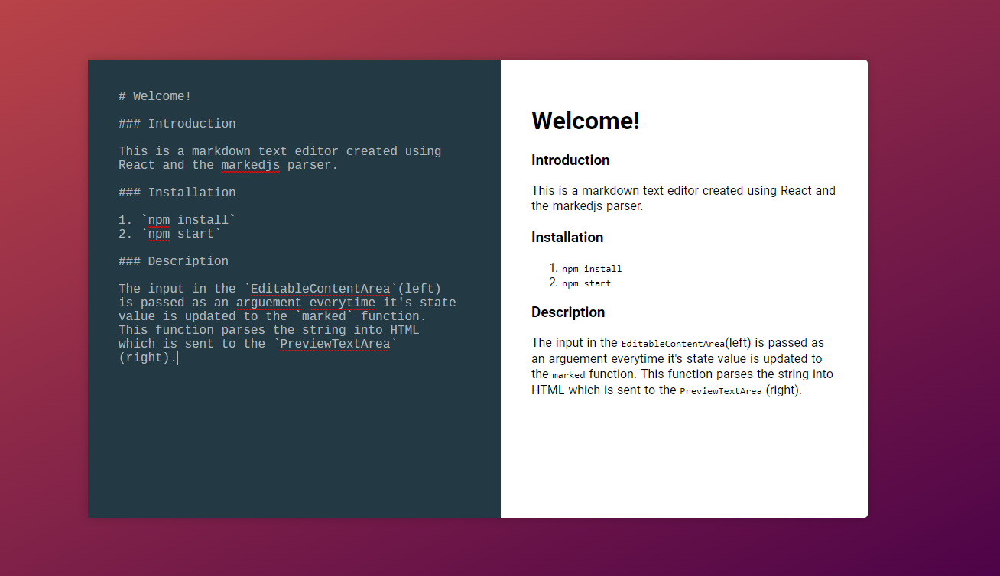

## Introduction

React Markdown Text Editor converts markdown to HTML.

## Installation

1. `npm install`
2. `npm start`

## Description

React Markdown Text Editor is a web app built using React. It uses markedjs to parse the markdown in the editor on the left and displays the HTML on the right.